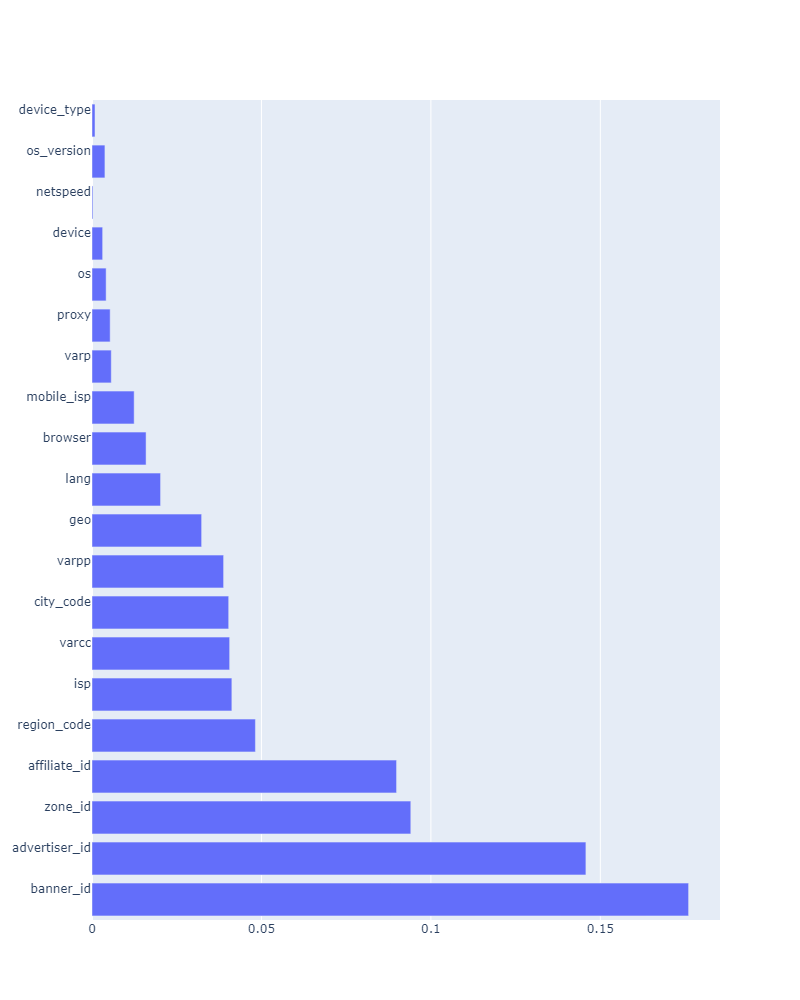

# Probability conversion prediction
Over the past decade, digital marketing has seen significant growth and development. However, the accuracy of prediction technologies in this field has often fallen short, particularly when it comes to predicting conversions. Conversion prediction remains a challenging task for many marketing professionals. In this task, we leverage a dataset that includes the content of landing pages, the number of impressions made by users, user features, as well as the number of conversions made by users after seeing advertisement on impressions. 

## Task
The goal of this task is to accurately predict the probability of a user making a conversion for each impression of a certain advertising banner. To solve this task, we consider this problem as a classification task determined by a conversion rate. As a result, we consider the probability outputs of the classifier. We assume that the results of the conversion probability are more accurate for the classifier with a better F1-score. 

## Installation
Clone this repository:
```
git clone https://github.com/mile888/conversion-prediction.git
```
The required packages can be installed via standard Python package manager:
```
pip install --upgrade pip
pip install -r requirements.txt
pip install xgboost
pip install scikit-optimize
```

## Dataset
The datasets for this task are available [here](https://drive.google.com/drive/folders/1eH5FLgAMjcMGdd8yHxjnO5IJOOZdJIuv).

The dataset consists of three files:
1. **ds_homework_sample.csv** - contains a random sample of the work of an advertising network with approximately 100 sites over two weeks. Each line represents data from the conversions and impressions metrics aggregated over the rest attributes. 
2. **train.csv** - is a cleaned `ds_homework_sample.csv` file prepared for classifier's training.
3. **test.csv** - is a cleaned `ds_homework_sample.csv` file prepared for classifier's validation.


## Guideline
Tree of the project:
```plaintext
project_root/
├── figures/
│   ├── best_features.png
│   ├── full_plot.png
│   └── undersample_plot.png  
├── save_models/
│   ├── best_features.pickle
│   ├── knn_model.pickle
│   ├── knn_param.pickle
│   ├── lr_model.pickle
│   ├── lr_param.pickle
│   ├── rf_model.pickle
│   ├── rf_param.pickle
│   ├── xgb_model.pickle
│   └── xgb_param.pickle
├── source/
│   ├── __init__.py
│   ├── mrmr.py
│   ├── predict.py
│   ├── train_validate.py
│   └── utils.py
├── .gitignore 
├── config.yaml
├── main.ipynb
├── main.py
├── README.md
└── requirements.txt
```
- [x] **To run this program**, you should call in the terminal:
```
python main.py
```
- [x] This repository contains configuration file `config.yaml` where you can 
chose the mode: 
1. `train` - it means to train classifier on `train.csv` dataset and validate on `test.csv` dataset.
2. `predict` - it means used trained models and directly work with raw dataset, for example `ds_homework_sample.csv` in this case.

- Accordingly you can config the roots of the datasets and chose the next options:
1. `train.csv` dataset - (e.g. `dataset_root_train: "datasets/train.csv"`)
2. `test.csv` dataset - (e.g. `dataset_root_test: "datasets/test.csv"`)
3. model (classifier) - (e.g. `model: "RF"`)
4. k best features - (e.g. `k_best_features: 2`)
5. number of hyperparameters bayesian optimization calls - (e.g. `n_calls: 30`)
6. model_treshold - (e.g. `model_treshold: 0.4`)
7. `ds_homework_sample.csv` - (e.g. `data: "datasets/ds_homework_sample.csv"`)
8. the nuber of index row from raw dataset - (e.g. `index_row: 1`)

- [x] `main.ipynb` nootebook is used for data engineering and creating cleaned `train.csv` and `test.csv` datasets

- [x] The **source** folder contains all the important files for solving the tasks of this assignment.
- `utils.py` contains the code for fitting and optimizing classifiers..
- `mrmr.py` contains the code of the so-called minimum redundancy maximum relevance feature engineering approach.
- `train_validate.py` contains pipeline for solving train\validation task. 
- `predict.py` contains a pipeline for solving this task from the raw dataset.

- [x] The **save_models** folder consists of the saved models and their parameter files.


## Pipeline
- [x] **Data engineering** task is done in `main.ipynb`. Important moments during the data engineering task were:

1. Feature `offer_id` has a lot of NaN values. Accordingly, we did not consider this feature at all.
2. Feature `geo` also has several NaN values, thus we just delete these rows. In this way, we did not influence the dataset, since rows with `geo` NaN values do not have any conversions.
3. Features such as [`geo`, `os_type`, `os`, `os_version`, `device_type`, `device`, `browser`, `lang`, `proxy`, `netspeed`] are categorical features. Accordingly, we apply LabelEncoder to encode these features.
4. To create a classification task, we create a new `cr` (conversions rate) column as the division (conversions/impressions), and using the mean of this distribution we categorize class 1 where samples are above the mean or 0 if they are equal to or below the mean. Accordingly, we create a new column `cp` (conversions probability).

**NOTE**:
During creating `cp` column, it was noticed that in some cases number of conversions is above number of the impressions. Moreover, all rows with zero impressions have one or more conversions. This is debatable and domain knowledge is required for this case in terms of whether these are errors or the number of conversions caused by some external factor. In order to avoid a bad impact on the dataset and later classifiers, we have removed all rows where the conversions are higher than the impressions. 

5. Since the dataset is highly imbalanced, it means that the majority class where no exist conversions is a lot higher than the minority class where conversions occur with some probability, we apply the clustering technique to reduce the number of majority class samples. Concretely, we apply the k-means unsupervised technique to cluster the majority class and thus randomly take several samples from each cluster.

6. In the end, we create cleaned and undersampled train and test datasets

- [x] **Feature engineering** task is done in the `mrmr.py` file. The idea was to implement the so-called `maximum relevance minimum redundancy` technique, where we eliminate redundant features with a high correlation between other features, and take features that have the best correlation with label output. For the `minimum redundancy`, we used `pearson corelation`, while for the `maximum relevance`, we applied the `mutual information` technique.

- [x] **Classifiers** are built in the `utils.py` file. In this task we consider 4 different classifiers:
1. Logistic Regression (LR)
2. k-Nearest Neighbors (KNN)
3. Random Forest (RF)
4. Extreme Gradient Boosting (XGB)

During fitting these classifiers Bayesian optimization is applied to tune the hyperparameters of each classifier.

## Results
To validate the results of the good accuracy of the conversion probability prediction, we consider `F1-score` as the metric of the efficiency of the classifier. `F1-score` is a harmonic mean of the `precision` and `recall`, and in this case, we would like the best classifiers to have both precision and recall. The results are presented in the table below for each classifier with optimal threshold:

| k best features| 2 | 4 | 8 | 10 | 15 | All |
|----------|----------|----------|----------|----------|----------|----------|
| LR | 0.76/0.06, trh=0.4 | 0.64/0.07, trh=0.4 | 0.66/0.09, trh=0.4 | 0.68/0.10, trh=0.4 | 0.69/0.10, trh=0.4 | 0.70/0.10, trh=0.4 |
| KNN | 0.80/0.19, trh=0.4  | 0.80/0.16, trh=0.4 | 0.80/0.15, trh=0.4 | 0.71/0.12, trh=0.4 | 0.80/0.15, trh=0.4 | 0.80/0.15, trh=0.4 |
| RF | 0.96/0.35, trh=0.7 | 0.96/0.32, trh=0.7 | 0.98/0.32, trh=0.7 | 0.98/0.27, trh=0.8 | 0.97/0.30, trh=0.7 | 0.97/0.28, trh=0.7 |
| XGB | 0.94/0.28, trh=0.7 | 0.97/0.31, trh=0.7 | 0.98/0.32, trh=0.8 | 0.94/0.27, trh=0.6 | 0.96/0.33, trh=0.7 | 0.91/0.27, trh=0.7 |

In the table, the first number is the F1-score for the negative class (conversion does not happen), and the second number for the positive class (conversion happens with 100% probability). `trh` is the optimal threshold for the determined classifier. 

From the results, we can see that the Decision Tree algorithms such as RF and XGB are more robust for this task. The best F1 score for the positive class we achieved with the RF and the first 2 best features. The order of the best features is shown in the figure bellow:


The probability of conversions for all test samples you can see by running `main.py` in the console

## Discussion
The main problem that classifiers have is to improve recall of the positive class. One of the reasons can be the nature of the dataset. Let's consider the example of the scatter plot between 2 features with sign classes for the original dataset and after undersampling:

**Original dataset**:


**Undersampled dataset**:


From the figures, we can see that for the original dataset, there is an overlap between the two classes. One of the problems can be the randomness of the conversions. For example, for rows where there were 0 impressions we have one or more conversions. Since we assume that it is an error, it can implicate that for rows with sure impressions, we can also have errors. In the minority class, more than 50% of the samples consist of 1 impression and 1 conversion. It means that with 100% we can guarantee that conversion will happen. However, there is the question of how many of them are errors. Because of that to properly define and solve this task we will need `domain knowledge` about the task and dataset that we have.
